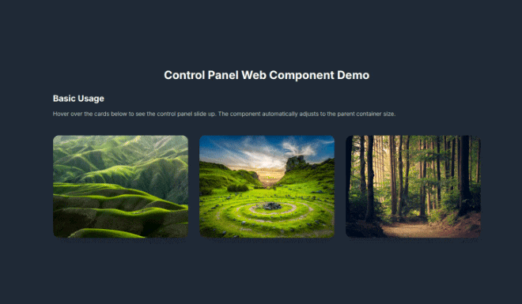
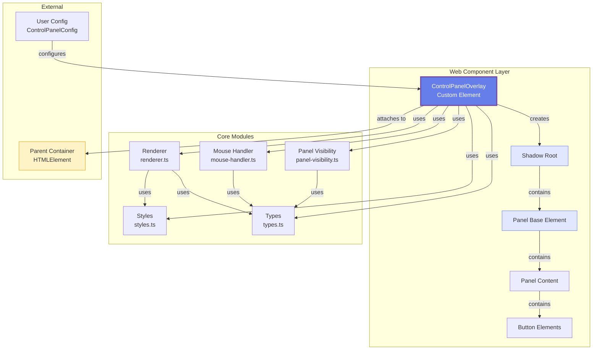
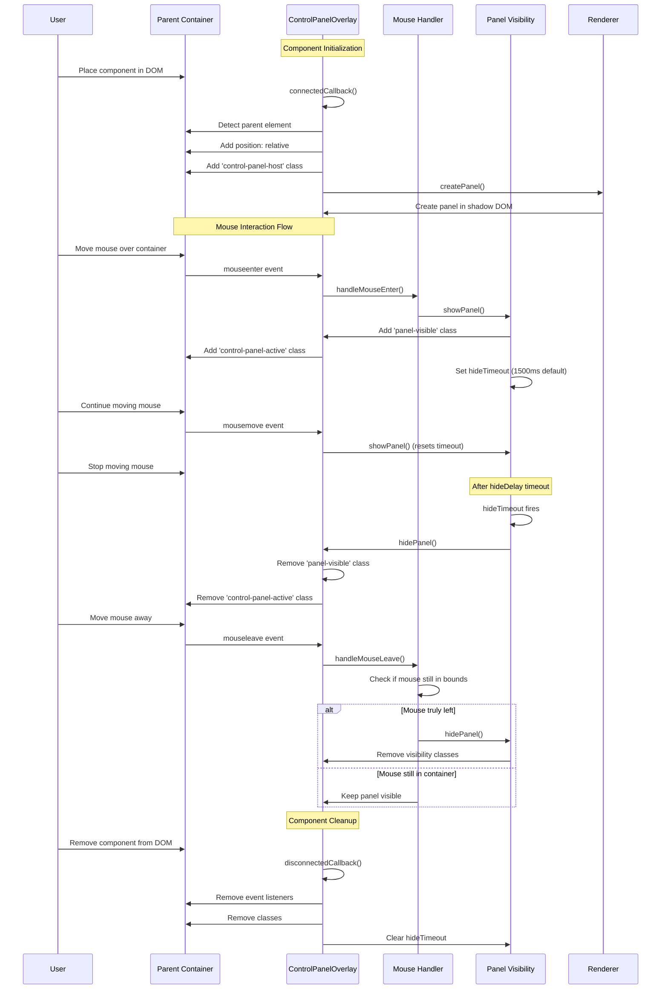
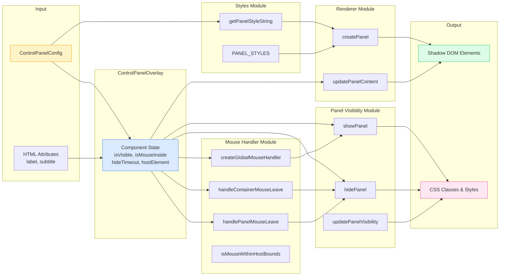
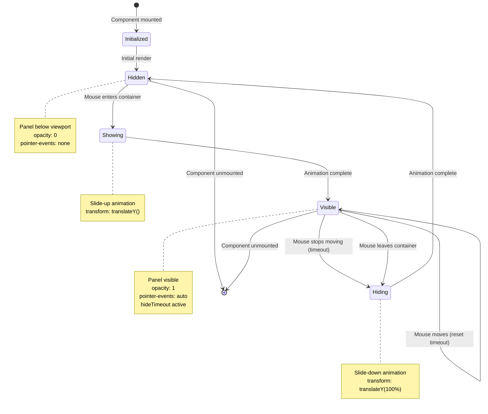

# Floating Controls

A beautiful, customizable floating control panel web component built with vanilla Web Components. Features a stunning glassmorphic design that automatically adjusts to its parent container size and elegantly slides up **on mouse movement** - no clicks required! Perfect for card interfaces, image galleries, dashboards, and any UI that needs elegant movement-activated controls.


## ?? Live Demo

**Try it now:** [View Demo on GitHub Pages](https://kai4avaya.github.io/float-controls/)



The control panel elegantly slides up from the bottom when you **move your mouse** over the parent container - no clicking required! It stays visible while you move, then automatically slides down after a configurable delay when movement stops. It provides a beautiful glassmorphic interface for your controls with smooth slide animations and customizable styling.

## Features

- **? Movement-Based Activation**: No clicks required! The panel smoothly slides up when you move your mouse and automatically slides down after a delay when movement stops
- **?? Glassmorphic Design**: Beautiful backdrop blur and translucent styling out of the box
- **? Smooth Animations**: Elegant slide-up transitions with customizable timing and easing
- **?? Framework Agnostic**: Works with React, Vue, Angular, Svelte, or vanilla HTML/JS
- **?? Auto-sizing**: Automatically adjusts to parent container dimensions (91.666667% width by default)
- **??? Highly Customizable**: Configure appearance, animations, and controls entirely via TypeScript
- **?? Button System**: Built-in button support with custom actions and SVG icons
- **?? Slot Support**: Add custom content via HTML slots
- **?? Responsive**: Works seamlessly across all screen sizes
- **?? Zero Dependencies**: Pure vanilla Web Components - no framework dependencies
- **?? TypeScript**: Full TypeScript support with type definitions included

## Installation

```bash
npm install floating-controls
```

**Note**: This package has zero dependencies - it's built with pure Web Components standards!

## Quick Start

### Basic Usage

**Important**: The parent container must have `position: relative` (or `absolute`/`fixed`). The component will automatically add this if not present.

```html
<!DOCTYPE html>
<html>
<head>
  <script type="module">
    import { ControlPanelOverlay } from 'floating-controls';
    
    // Register the custom element
    if (!customElements.get('control-panel-overlay')) {
      customElements.define('control-panel-overlay', ControlPanelOverlay);
    }
  </script>
</head>
<body>
  <!-- Parent container with position: relative -->
  <div style="position: relative; width: 400px; height: 300px; background: url('image.jpg');">
    <!-- Place the component INSIDE the parent container -->
    <control-panel-overlay 
      label="Card Title" 
      subtitle="Card description">
    </control-panel-overlay>
  </div>
</body>
</html>
```

**How it works:**
1. Place `<control-panel-overlay>` **inside** a parent container
2. The parent container should have `position: relative` (auto-added if missing)
3. **Move your mouse** over the parent container → controls slide up
4. **Keep moving** → controls stay visible
5. **Stop moving** → controls slide down after delay (default: 1.5 seconds)
6. **Move mouse away** → controls slide down immediately

### With Action Buttons

```html
<div style="position: relative; width: 400px; height: 300px; background: linear-gradient(135deg, #667eea 0%, #764ba2 100%);">
  <control-panel-overlay 
    label="My Card" 
    subtitle="Description"
    id="myPanel">
  </control-panel-overlay>
</div>

<script type="module">
  import { ControlPanelOverlay } from 'floating-controls';
  
  const panel = document.getElementById('myPanel');
  panel.config = {
    buttons: [
      {
        label: 'Like',
        icon: `<svg xmlns="http://www.w3.org/2000/svg" width="24" height="24" viewBox="0 0 24 24" fill="none" stroke="currentColor" stroke-width="2"><path d="M20.84 4.61a5.5 5.5 0 0 0-7.78 0L12 5.67l-1.06-1.06a5.5 5.5 0 0 0-7.78 7.78l1.06 1.06L12 21.23l7.78-7.78 1.06-1.06a5.5 5.5 0 0 0 0-7.78z"></path></svg>`,
        action: () => {
          console.log('Liked!');
          alert('Liked!');
        }
      },
      {
        label: 'Share',
        icon: `<svg xmlns="http://www.w3.org/2000/svg" width="24" height="24" viewBox="0 0 24 24" fill="none" stroke="currentColor" stroke-width="2"><circle cx="18" cy="5" r="3"></circle><circle cx="6" cy="12" r="3"></circle><circle cx="18" cy="19" r="3"></circle><line x1="8.59" y1="13.51" x2="15.42" y2="17.49"></line><line x1="15.41" y1="6.51" x2="8.59" y2="10.49"></line></svg>`,
        action: () => {
          console.log('Shared!');
          alert('Shared!');
        }
      }
    ]
  };
</script>
```

### Custom Styling

```javascript
import { ControlPanelOverlay } from 'floating-controls';

const panel = document.getElementById('myPanel');
panel.config = {
  width: '90%',
  padding: '1.25rem',
  borderRadius: '0.75rem',
  backgroundColor: 'rgba(0, 0, 0, 0.3)',
  backdropBlur: '16px',
  borderColor: 'rgba(255, 255, 255, 0.3)',
  transitionDuration: '0.6s',
  slideUpOffset: '-0.5rem',
  hideDelay: 2000, // Stay visible for 2 seconds after mouse stops moving
  buttons: [
    // ... your buttons
  ]
};
```

### With Custom Slot Content

```html
<control-panel-overlay label="Title" subtitle="Subtitle">
  <div style="margin-top: 0.5rem; font-size: 0.875rem; opacity: 0.8;">
    Your custom content here
  </div>
</control-panel-overlay>
```

### React Example

```jsx
import { useEffect, useRef } from 'react';
import { ControlPanelOverlay } from 'floating-controls';

// Register the custom element once (e.g., in your main App.js or index.js)
if (!customElements.get('control-panel-overlay')) {
  customElements.define('control-panel-overlay', ControlPanelOverlay);
}

function Card({ image, title, subtitle }) {
  const panelRef = useRef(null);

  useEffect(() => {
    // Configure the panel after it's mounted
    if (panelRef.current) {
      panelRef.current.config = {
        hideDelay: 2000, // Stay visible for 2 seconds after mouse stops
        buttons: [
          {
            label: 'Like',
            icon: '<svg xmlns="http://www.w3.org/2000/svg" width="24" height="24" viewBox="0 0 24 24" fill="none" stroke="currentColor" stroke-width="2"><path d="M20.84 4.61a5.5 5.5 0 0 0-7.78 0L12 5.67l-1.06-1.06a5.5 5.5 0 0 0-7.78 7.78l1.06 1.06L12 21.23l7.78-7.78 1.06-1.06a5.5 5.5 0 0 0 0-7.78z"></path></svg>',
            action: () => console.log('Liked!')
          }
        ]
      };
    }
  }, []);

  return (
    // ✅ Parent container with position: relative
    <div style={{ position: 'relative', width: '400px', height: '300px' }}>
      
      {/* ✅ Component inside parent */}
      <control-panel-overlay 
        ref={panelRef}
        label={title} 
        subtitle={subtitle}
      />
    </div>
  );
}
```

### Vue Example

```vue
<template>
  <!-- ✅ Parent container with position: relative -->
  <div style="position: relative; width: 400px; height: 300px;">
    
    <!-- ✅ Component inside parent -->
    <control-panel-overlay 
      ref="panel"
      :label="title" 
      :subtitle="subtitle"
    />
  </div>
</template>

<script setup>
import { ref, onMounted } from 'vue';
import { ControlPanelOverlay } from 'floating-controls';

// Register the custom element
if (!customElements.get('control-panel-overlay')) {
  customElements.define('control-panel-overlay', ControlPanelOverlay);
}

const panel = ref(null);

onMounted(() => {
  // Configure the panel after it's mounted
  if (panel.value) {
    panel.value.config = {
      hideDelay: 2000, // Stay visible for 2 seconds after mouse stops
      buttons: [
        {
          label: 'Like',
          icon: '<svg xmlns="http://www.w3.org/2000/svg" width="24" height="24" viewBox="0 0 24 24" fill="none" stroke="currentColor" stroke-width="2"><path d="M20.84 4.61a5.5 5.5 0 0 0-7.78 0L12 5.67l-1.06-1.06a5.5 5.5 0 0 0-7.78 7.78l1.06 1.06L12 21.23l7.78-7.78 1.06-1.06a5.5 5.5 0 0 0 0-7.78z"></path></svg>',
          action: () => console.log('Liked!')
        }
      ]
    };
  }
});
</script>
```

## API Reference

### Component: `<control-panel-overlay>`

The main web component that renders the floating control panel.

### Properties

| Property | Type | Default | Description |
|----------|------|---------|-------------|
| `label` | `string` | `'Controls'` | Main title text displayed in the panel |
| `subtitle` | `string` | `''` | Subtitle text displayed below the title |
| `config` | `ControlPanelConfig` | `{}` | Configuration object for styling and buttons |

### ControlPanelConfig Interface

```typescript
interface ControlPanelConfig {
  // Layout
  width?: string;              // Panel width (default: '91.666667%')
  padding?: string;             // Panel padding (default: '1rem')
  borderRadius?: string;        // Border radius (default: '1rem')
  
  // Visual styling
  backgroundColor?: string;     // Background color (default: 'rgba(255, 255, 255, 0.1)')
  backdropBlur?: string;        // Backdrop blur amount (default: '12px')
  borderColor?: string;         // Border color (default: 'rgba(255, 255, 255, 0.2)')
  
  // Animation
  transitionDuration?: string;  // Transition duration (default: '0.5s')
  slideUpOffset?: string;       // Slide up offset when visible (default: '-1rem')
  hideDelay?: number;           // Delay in ms before hiding after mouse stops moving (default: 1500)
  
  // Controls
  buttons?: ControlButton[];    // Array of button configurations
}
```

### ControlButton Interface

```typescript
interface ControlButton {
  label?: string;      // Button label/tooltip (displayed when no icon)
  icon?: string;       // SVG icon HTML string (takes precedence over label)
  action: () => void;  // Click handler function
  className?: string;  // Additional CSS class for custom styling
}
```

### CSS Classes

The component injects classes into the parent element for styling hooks:

- `.control-panel-host` - Added to the parent element automatically
- `.control-panel-active` - Added when the panel is visible (on hover)

You can use these classes to style the parent when the panel is active:

```css
.control-panel-host {
  transition: transform 0.3s ease;
}

.control-panel-host.control-panel-active {
  transform: scale(1.02);
}
```

## Styling Examples

### Dark Theme Panel

```javascript
panel.config = {
  backgroundColor: 'rgba(0, 0, 0, 0.5)',
  backdropBlur: '20px',
  borderColor: 'rgba(255, 255, 255, 0.1)',
  width: '95%'
};
```

### Minimal Panel

```javascript
panel.config = {
  backgroundColor: 'rgba(255, 255, 255, 0.05)',
  backdropBlur: '8px',
  borderColor: 'rgba(255, 255, 255, 0.1)',
  padding: '0.75rem',
  borderRadius: '0.5rem'
};
```

### Wide Panel

```javascript
panel.config = {
  width: '98%',
  padding: '1.5rem'
};
```

## Development

### Setup

```bash
git clone https://github.com/kai4avaya/float-controls.git
cd float-controls
npm install
```

### Build

```bash
# Build library version (zero dependencies)
npm run build

# Build bundled demo version
npm run build:demo
```

### Development Server

```bash
npm run dev
```

Then open `http://localhost:5173/demo.html` in your browser.

### Running the Demo

After building, you can view the demo:

```bash
# Option 1: Use Python HTTP server
python3 -m http.server 8000
# Then open http://localhost:8000/demo.html

# Option 2: Use Vite preview
npm run preview
```

### Testing

```bash
npm test
```

## How It Works

1. **Parent Detection**: The component automatically detects its parent element on mount
2. **Position Injection**: Adds `position: relative` to the parent if not already set
3. **Event Listeners**: Attaches mouse enter/leave/move listeners to the parent element
4. **Slide Animation**: Smoothly slides up from the bottom when mouse moves over the parent
5. **Auto-Hide**: Automatically slides down after a configurable delay when mouse movement stops
6. **Styling**: Uses CSS transforms and opacity for smooth slide animations
7. **Customization**: All styling and controls configurable via the `config` property

## Architecture

### Component Architecture



### Event Flow & Lifecycle



### Module Dependencies & Data Flow



### Runtime Behavior Flow



## Usage Guidelines

### ✅ Correct Usage

```html
<!-- ✅ CORRECT: Component inside parent with position: relative -->
<div style="position: relative; width: 400px; height: 300px;">
  <control-panel-overlay label="Title" subtitle="Subtitle"></control-panel-overlay>
</div>

<!-- ✅ CORRECT: Parent with position: absolute -->
<div style="position: absolute; width: 100%; height: 100%;">
  <control-panel-overlay label="Title"></control-panel-overlay>
</div>

<!-- ✅ CORRECT: Component will auto-add position: relative if missing -->
<div style="width: 400px; height: 300px;">
  <control-panel-overlay label="Title"></control-panel-overlay>
</div>
```

### ❌ Incorrect Usage

```html
<!-- ❌ WRONG: Component outside parent container -->
<control-panel-overlay label="Title"></control-panel-overlay>
<div style="position: relative; width: 400px; height: 300px;">
  <!-- Content here -->
</div>

<!-- ❌ WRONG: Parent without positioning (though component will try to fix this) -->
<div style="width: 400px; height: 300px;">
  <control-panel-overlay label="Title"></control-panel-overlay>
</div>
```

### Key Points

- **Placement**: Always place `<control-panel-overlay>` **inside** the parent container you want to attach controls to
- **Parent Positioning**: Parent should have `position: relative`, `absolute`, or `fixed` (component auto-adds `relative` if missing)
- **Mouse Interaction**: Controls slide up on **mouse movement**, not just hover
- **Timing**: Controls stay visible while mouse moves, then slide down after `hideDelay` milliseconds (default: 1500ms)
- **Configuration**: Set `config` property after the element is in the DOM (use `useEffect` in React, `onMounted` in Vue, or `DOMContentLoaded` in vanilla JS)

## Troubleshooting

### Controls don't slide up

**Check these common issues:**

1. **Wrong version**: If you see Lit-related errors, you're using version 1.x. Upgrade to 2.x:
   ```bash
   npm install floating-controls@latest
   ```

2. **Component placement**: Ensure `<control-panel-overlay>` is **inside** the parent container:
   ```html
   <!-- ✅ CORRECT -->
   <div style="position: relative;">
     <control-panel-overlay></control-panel-overlay>
   </div>
   
   <!-- ❌ WRONG -->
   <control-panel-overlay></control-panel-overlay>
   <div style="position: relative;"></div>
   ```

3. **Mouse movement required**: Controls slide up on **mouse movement**, not just hover. Move your mouse over the parent container.

4. **Parent positioning**: Parent should have `position: relative` (component auto-adds it, but explicit is better).

5. **CSS conflicts**: Check if your CSS is overriding transitions:
   ```css
   /* Make sure nothing is overriding these */
   .panel-base {
     transition: transform 0.5s ease-out, opacity 0.5s ease;
   }
   ```

6. **Element not registered**: Ensure you've registered the custom element:
   ```javascript
   if (!customElements.get('control-panel-overlay')) {
     customElements.define('control-panel-overlay', ControlPanelOverlay);
   }
   ```

### Lit Directive Error (Version 1.x)

If you see this error:
```
TypeError: currentDirective._$initialize is not a function
```

**Solution**: Upgrade to version 2.x which removed Lit dependency:
```bash
npm install floating-controls@latest
```

Version 2.x uses vanilla Web Components and fixes this issue.

## Browser Support

- Chrome/Edge (latest)
- Firefox (latest)
- Safari (latest)
- Any browser supporting:
  - Web Components (Custom Elements v1)
  - CSS `backdrop-filter`
  - ES Modules

**Note**: For older browsers, you may need polyfills for Web Components and CSS backdrop-filter.

## Changelog

### Version 2.1.8

**Bug Fixes:**

- ✅ **Fixed panel hiding incorrectly when mouse leaves panel but stays in container** - Panel now correctly stays visible when moving from panel to other elements within the container
- ✅ **Added `elementFromPoint` fallback** - Improved reliability in test environments and browsers where `relatedTarget` may be unreliable
- ✅ **Fixed global mouse tracking** - Prevents incorrect hiding in test environments where `getBoundingClientRect()` returns invalid values
- ✅ **Improved mouse movement timeout handling** - Timeout now correctly resets on mouse movement within container

**Technical Improvements:**

- Enhanced hover detection with multiple fallback mechanisms (relatedTarget → elementFromPoint → boundingRect → global tracking)
- Better handling of edge cases in synthetic event environments
- More robust mouse position detection across different browser environments

### Version 2.1.7

- Initial stable release with improved hover behavior

### Version 2.0.0 (Breaking Changes)

**Major Migration: Removed Lit Dependency**

- ✅ **Converted from Lit to vanilla Web Components** - No framework dependencies required!
- ✅ **Fixed bug with SVG icons in buttons** - Resolved `unsafeHTML` directive error
- ✅ **Zero dependencies** - Pure Web Components standards implementation
- ✅ **Smaller bundle size** - Reduced from requiring Lit to standalone component
- ✅ **Same API** - All existing functionality preserved, no API changes

**Migration Guide:**
- If you were using version 1.x, simply update to 2.0.0 - no code changes needed!
- Remove `lit` from your dependencies if you're not using it elsewhere
- The component now works without any peer dependencies

### Version 1.0.5

- Initial release with Lit-based implementation

## License

MIT License - feel free to use in personal and commercial projects.

## Contributing

Contributions are welcome! Please feel free to submit a Pull Request.

## Acknowledgments

Built with pure Web Components standards - no framework dependencies required!

---

Made with ?? for the web component community
